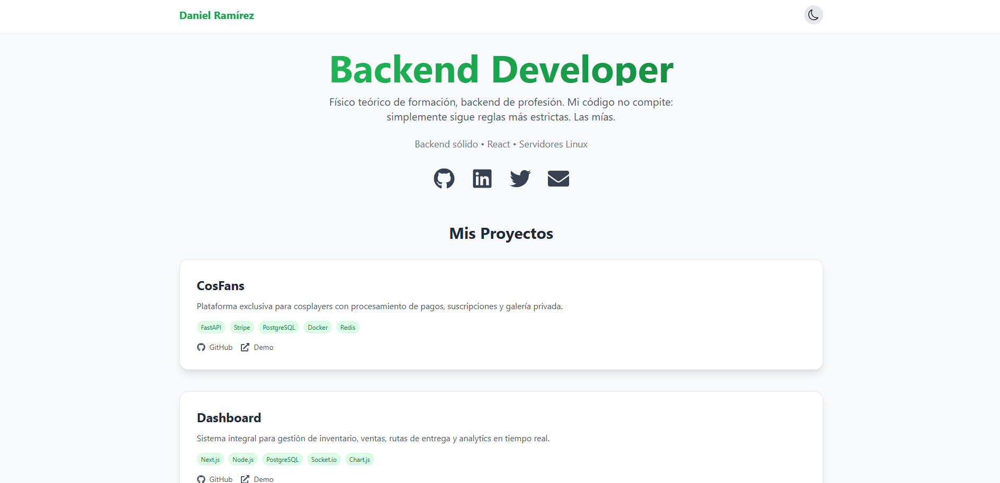

 # Portafolio Personal de Miguel D. Ramírez

Portafolio web moderno y responsive construido con React + Vite, diseñado para mostrar proyectos de backend development con un diseño limpio y profesional.



---

## Tabla de Contenidos

- [Características](#-características)
- [Tecnologías](#-tecnologías)
- [Estructura del Proyecto](#-estructura-del-proyecto)
- [¿Cómo se instala?](#-¿Cómo-se-instala?)
- [Uso](#-uso)
- [Componentes Principales](#-componentes-principales)
- [Configuración](#-configuración)
- [Personalización](#-personalización)

---

## Características

- **Diseño Responsivo**: Totalmente adaptable a móviles, tablets y desktop
- **Modo Oscuro/Claro**: Toggle persistente con localStorage
- **Optimizado para rendimiento**: Vite + React con lazy loading
- **Diseño moderno**: Tailwind CSS con gradientes y animaciones
- **Accesibilidad**: ARIA labels y navegación por teclado

---

## Tecnologías

### Núcleo
- **React 18** - Biblioteca de UI
- **Vite** - Build tool y dev server
- **Tailwind CSS** - Framework de utilidades para CSS
- **React Icons** - Biblioteca de íconos

### Dependencias
```json
{
  "react": "^18.x",
  "react-dom": "^18.x",
  "react-icons": "^5.x"
}
```

### Dependencias de Desarrollo
```json
{
  "vite": "^5.x",
  "tailwindcss": "^3.x",
  "postcss": "^8.x",
  "autoprefixer": "^10.x"
}
```

---

## Estructura del Proyecto

```
PORTAFOLIO/
├── node_modules/          # Dependencias instaladas
├── public/                # Archivos estáticos
│   ├── favicon.svg       # Favicon del sitio
│   ├── icons.svg         # Sprite de íconos
│   └── vite.svg          # Logo de Vite
├── src/
│   ├── assets/           # Recursos multimedia
│   │   ├── hero.png      # Imagen principal (captura de pantalla del proyecto)
│   │   ├── react.svg     # Logo de React
│   │   └── vite.svg      # Logo de Vite
│   ├── App.css           # Estilos personalizados
│   ├── App.jsx           # Componente principal
│   ├── index.css         # Estilos globales + Tailwind
│   └── main.jsx          # Punto de entrada de React
├── .gitignore            # Archivos ignorados por Git
├── eslint.config.js      # Configuración de ESLint
├── index.html            # HTML principal
├── package.json          # Dependencias y scripts
├── package-lock.json     # Lock file de npm
├── postcss.config.js     # Configuración de PostCSS
├── README.md             # Este archivo
├── tailwind.config.js    # Configuración de Tailwind
└── vite.config.js        # Configuración de Vite
```

---

## ¿Cómo se instala?

### Requisitos Previos
- Node.js >= 16.x
- npm >= 8.x (o yarn/pnpm)

### Pasos

1. **Clonar el repositorio**
```bash
git clone https://github.com/NeilRmz/portafolio.git
cd portafolio
```

2. **Instalar dependencias**
```bash
npm install
```

3. **Iniciar servidor de desarrollo**
```bash
npm run dev
```

4. **Abrir en navegador**
```
http://localhost:5173
```

---

## Uso

### Scripts Disponibles

```bash
# Para iniciar servidor local
npm run dev

# Build (generar archivos de producción)
npm run build

# Preview - previsualiza el build de producción
npm run preview

# Lint - revisa errores de código
npm run lint
```

---

## Componentes Principales

### 1. **App.jsx** - Componente Principal

**Propósito**: Contiene toda la lógica y estructura del portafolio.

**Funcionalidades**:
- **Estado del modo oscuro**: Usa `useState` + `localStorage` para persistencia
- **Array de proyectos**: Define todos los proyectos con metadata
- **Renderizado condicional**: Cambia clases según modo oscuro/claro

**Secciones renderizadas**:
- `<header>`: Logo + toggle de modo oscuro
- `<section>` Hero: Título, descripción, íconos sociales
- `<section>` Proyectos: Grid de tarjetas de proyectos
- `<section>` CTA: Call-to-action para contratar

**Código clave**:
```jsx
// Manejo de modo oscuro
const [darkMode, setDarkMode] = useState(() => {
  const savedMode = localStorage.getItem('darkMode');
  return savedMode === 'true';
});

useEffect(() => {
  if (darkMode) {
    document.documentElement.classList.add('dark');
    localStorage.setItem('darkMode', 'true');
  } else {
    document.documentElement.classList.remove('dark');
    localStorage.setItem('darkMode', 'false');
  }
}, [darkMode]);
```

---

### 2. **App.css** - Estilos Personalizados

**Propósito**: Define estilos específicos que Tailwind no cubre.

**Qué hace cada regla**:

```css
/* BASE: Tamaño por defecto de todos los SVG */
svg {
  width: 56px;
  height: 56px;
  transition: all 0.3s ease;
  color: #ffadff;
}
```
→ Establece tamaño grande para íconos sociales principales.

```css
/* CONTEXTO: Íconos dentro de botones */
button svg {
  width: 24px;
  height: 24px;
}
```
→ Reduce tamaño para botones (toggle modo oscuro).

```css
/* CONTEXTO: Íconos dentro de flex (proyectos) */
.flex svg {
  width: 16px;
  height: 16px;
}
```
→ Tamaño pequeño para GitHub/Demo links.

```css
/* CONTEXTO: Íconos en CTA */
.inline-flex svg {
  width: 18px;
  height: 18px;
}
```
→ Tamaño medio para botón de contratar.

```css
/* HOVER: Efecto de escala */
svg:hover {
  transform: scale(1.1);
  color: #ffc5ff;
}
```
→ Agranda y cambia color al pasar el mouse.

```css
/* FILL/STROKE: Asegura renderizado correcto */
svg[fill="currentColor"] {
  stroke: none;
}

svg[stroke="currentColor"] {
  fill: none;
  stroke-width: 1.5px;
}

---

### 3. **main.jsx** - Punto de Entrada

**Propósito**: Monta la aplicación React en el DOM.

**Por qué se usa**:
```jsx
import React from 'react';
import ReactDOM from 'react-dom/client';
```
→ Importa React y ReactDOM (necesarios para renderizar).

```jsx
import App from './App';
import './index.css';
```
→ Importa componente principal y estilos globales.

```jsx
ReactDOM.createRoot(document.getElementById('root')).render(
  <React.StrictMode>
    <App />
  </React.StrictMode>
);
```
→ Crea la raíz de React en el elemento `#root` del HTML.

**¿Por qué `StrictMode`?**
- Porque detecta problemas en el desarrollo antes de compilar.

---

### 4. **index.css** - Estilos Globales

**Propósito**: Importa Tailwind y define estilos base.

**Estructura típica**:
```css
@tailwind base;
@tailwind components;
@tailwind utilities;

/* Estilos personalizados aquí */
```
```
@tailwind base;
@tailwind components;
@tailwind utilities;

@layer base {
  body {
    @apply antialiased;
  }
}
```
---

### 5. **tailwind.config.js** - Configuración de Tailwind

**Propósito**: Define comportamiento y extensiones de Tailwind.

**Qué hace cada parte**:

```javascript
darkMode: 'class',
```
→ **Modo oscuro basado en clase**: Tailwind aplica estilos dark: cuando el elemento `<html>` tiene la clase `dark`. Esto permite control manual en lugar del automático de las preferencia del sistema.

```javascript
content: [
  "./index.html",
  "./src/**/*.{js,ts,jsx,tsx}",
],
```
→ **Purga de CSS**: Le dice a Tailwind dónde buscar clases usadas. En producción, elimina clases no utilizadas para reducir tamaño del bundle.

```javascript
theme: {
  extend: {
    colors: {
      verde: {
        400: '#4ade80',
        500: '#22c55e',
        600: '#16a34a',
        700: '#15803d',
      }
    }
  },
},
```
→ **Colores personalizados**: Extiende la paleta de Tailwind con colores "verde" personalizados.
```javascript
plugins: [],
```
→ Espacio para agregar plugins de Tailwind (No tengo plugins).

---

## Configuración

### Modo Oscuro

El modo oscuro se almacena en `localStorage` con la clave `darkMode`:
- `"true"` = modo oscuro
- `"false"` = modo claro

**Flujo**:
1. El usuario hace clic en toggle
2. `setDarkMode(!darkMode)` actualiza el estado
3. `useEffect` detecta el cambio
4. Agrega/quita la clase `dark` en `<html>`
5. Guarda esta preferencia en `localStorage`

---

## Personalización

### 1. Cambiar Proyectos

Los proyectos están en arreglos, cambialos en `projects` en `App.jsx`:

```jsx
const projects = [
  {
    title: "Nombre del Proyecto",
    description: "Descripción breve",
    tech: ["Tech1", "Tech2", "Tech3"],
    github: "https://github.com/usuario/repo",
    demo: "https://demo-url.com"
  },
  // ... más proyectos
];
```

### 2. Cambiar Colores

**Opción A - Usar colores de Tailwind**:
```jsx
className="text-green-600 dark:text-green-400"
className="bg-blue-500 hover:bg-blue-600"
```

**Opción B - Agregar colores personalizados**:
```javascript
// tailwind.config.js
theme: {
  extend: {
    colors: {
      brand: {
        light: '#...',
        DEFAULT: '#...',
        dark: '#...',
      }
    }
  }
}
```

### 3. Cambiar Información Personal

En `App.jsx`, busca y reemplaza:
- **Nombre**: `<h1>Daniel Ramírez</h1>`
- **Título**: `<h2>Backend Developer</h2>`
- **Descripción**: `<p>Físico teórico de formación...</p>`
- **Email**: `mailto:danmrmz@proton.me`
- **Redes sociales**: Links de GitHub, LinkedIn, Twitter

### 4. Agregar Nueva Sección

```jsx
<section className="mb-12 sm:mb-16">
  <h3 className="text-2xl sm:text-3xl font-bold mb-6 text-center">
    Nueva Sección
  </h3>
  {/* Contenido aquí */}
</section>
```
---

## Contribuciones

Las contribuciones son bienvenidas. Para cambios importantes:

1. Fork el proyecto
2. Crea una rama (`git checkout -b feature/AmazingFeature`)
3. Commit cambios (`git commit -m 'Add some AmazingFeature'`)
4. Push a la rama (`git push origin feature/AmazingFeature`)
5. Abre un Pull Request

---

## Agradecimientos

- Marvin Valencia (Jochis)

---

<div align="center">

Hecho con amor y mucho café por MIguel D. Ramírez

</div>
